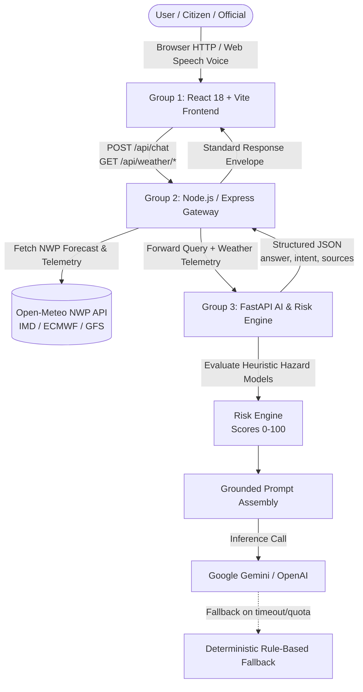

# WeatherGPT — Hyperlocal AI Weather Intelligence & Early Warning System

> **Smart India Hackathon 2026** · *Disaster Management, Agriculture, and Community Resilience*

WeatherGPT is an early-warning weather and environmental intelligence platform designed to bridge the gap between raw meteorological numerical predictions and actionable, human-centric decisions. It couples real-time numerical weather prediction (NWP) telemetry from Open-Meteo with an algorithmic multi-hazard risk engine and grounded Large Language Model (LLM) reasoning.

---

## 🏛️ Judge & Evaluator Documentation Hub

Quick links to specialized evaluation documentation:

| Document | Purpose | Description |
| :--- | :--- | :--- |
| 📖 [**Judge Guide**](docs/JUDGE_GUIDE.md) | **Evaluation Hub** | 3–5 minute demo flow, what to test, real data sources & reliability. |
| ⏱️ [**Demo Script**](docs/DEMO_SCRIPT.md) | **Live Presentation** | Step-by-step timed presenter walkthrough script. |
| 📋 [**Project Overview**](docs/PROJECT_OVERVIEW.md) | **Context & Tech** | Objectives, user personas, end-to-end workflow, and stack. |
| ✅ [**Feature Matrix**](docs/FEATURES.md) | **Verified Features** | Factual status table strictly separating Current MVP from Future Expansions. |
| 📈 [**Progress Tracker**](docs/PROGRESS.md) | **Milestones & Tests** | Verified implementation milestones (`[x] Current MVP`, `[~] Partial`, `[ ] Future`). |
| 📌 [**Submission Checklist**](docs/CHECKLIST.md) | **Compliance** | Security, testing, architecture, and future readiness checklist. |
| 🚀 [**Future Expansions**](docs/FUTURE_EXPANSIONS.md) | **Roadmap** | Detailed future roadmap organized across categories A through E. |
| 🏗️ [**Architecture Blueprint**](docs/ARCHITECTURE.md) | **System Design** | Current architecture and future architecture concept diagrams. |
| ⚙️ [**Setup & Deployment**](docs/SETUP.md) | **Run Locally** | Step-by-step installation commands and environment configuration. |
| 🔌 [**API Reference**](docs/API.md) | **Endpoint Specs** | Complete HTTP specification of genuine implemented endpoints. |
| 🗺️ [**Project Structure**](docs/PROJECT_STRUCTURE.md) | **Codebase Map** | Directory and file-by-file layout. |

---

## 1. Project Overview

### The Problem
* **The Raw Data Gap**: Numerical forecasts present isolated metrics (*998 hPa, 45 J/kg CAPE, 82% humidity*). Ordinary citizens, farmers, and emergency teams struggle to determine whether these figures indicate flash flooding, crop failure, or safe travel.
* **AI Hallucinations in Safety Contexts**: Generic conversational chatbots hallucinate weather numbers because they lack access to verified real-time atmospheric observations.
* **Single Points of Failure**: Conventional cloud web applications fail when external LLM endpoints, databases, or cache layers go down during storms.

### The Solution
WeatherGPT provides a resilient 3-tier microservice architecture that:
1. Ingests live atmospheric observations from Open-Meteo (aggregating IMD, ECMWF, and GFS).
2. Evaluates deterministic multi-hazard mathematical risk models (0–100 score).
3. Grounds generative AI on live sensor telemetry to answer questions truthfully, backed by an automatic deterministic fallback mode.

---

## 2. Current MVP Capabilities

The following features are **fully implemented, tested, and operational today**:

* **Live Atmospheric Telemetry**: Real-time tracking of temperature, feels-like, humidity, rain probability, wind velocity, surface pressure, UV index, visibility, CAPE, and lightning discharge flags.
* **Multi-Hazard Algorithmic Risk Engine**: Deterministic scoring across flood risk, extreme heatwaves, convective storms, and visibility hazards in Python FastAPI.
* **Grounded "Ask AI" Conversational Assistant**: Context-aware queries strictly grounded in real-time sensor metrics with cited evidence sources and intent tags.
* **Deterministic Fallback Engine (`mode: "fallback"`)**: Automatically activates when LLM keys are absent or endpoints time out, providing factual rule-based advice.
* **Hands-Free Voice Recognition**: Web Speech API integration for speech-to-text inputs.
* **Geofenced Severe Weather Alerts**: Severity-tiered alerts (Red Warning, Orange Watch, Yellow Advisory) with action modals.
* **Sector-Specific Advisory Modes**: Tailored card views for Agriculture (crop protection & spraying), Cyclone Monitoring, Aviation, and Marine operations.
* **Global Unit Harmonization**: Real-time unit conversions (`°C`/`°F`, `km/h`/`mph`, `mm`/`in`, `hPa`/`inHg`) propagated synchronously across all active views via a centralized `PreferencesContext`.
* **Database & Cache Fallbacks**: Automatic fallback to in-memory storage when MongoDB or Redis are unavailable.

---

## 3. Future Platform Vision

WeatherGPT is designed to evolve into an AI-powered weather and environmental intelligence platform serving general users, farmers, disaster-response personnel, aviation coordinators, marine operators, and vulnerable populations with limited smartphone or internet access.

### Core Future Expansions:
1. **Toll-Free Voice Access**: A dedicated telephony/IVR interface allowing callers to dial a toll-free number for spoken forecasts, alerts, and agricultural advice over basic feature phones without requiring internet access. *(Status: FUTURE / NOT CURRENTLY IMPLEMENTED).*
2. **Advanced RAG**: Semantic vector retrieval across official ICAR crop bulletins, district flood SOPs, and government relief manuals. *(Status: FUTURE / NOT CURRENTLY IMPLEMENTED).*
3. **Multi-Source Data Ingestion**: Additional meteorological radar, satellite, and environmental sensors (IMD AWS radar, ISRO INSAT-3D, Tomorrow.io). *(Status: FUTURE).*
4. **Regional & Hyperlocal Intelligence**: Block- and panchayat-level micro-climate modeling combining elevation contours with local crop calendars. *(Status: FUTURE).*
5. **Expanded Farmer Advisory**: Crop-specific phenology calculators (paddy, cotton, chilli, wheat), soil moisture sensor telemetry, and pest/disease risk modeling. *(Status: FUTURE EXPANSION).*
6. **Cyclone Intelligence**: Automated storm track cone visualization, barometric pressure drop velocity alerts, storm surge depth modeling, and landfall ETA projections. *(Status: FUTURE EXPANSION).*
7. **Aviation Intelligence**: Automated METAR and TAF telegraphic report decoding and runway crosswind component calculators. *(Status: FUTURE EXPANSION).*
8. **Marine Intelligence**: Real-time hydrodynamic wave models (wave height, swell period, sea surface temperature, and potential fishing zones). *(Status: FUTURE EXPANSION).*
9. **Interactive GIS / Map Intelligence**: Spatial hazard visualization layers built upon the preserved Leaflet foundation in `archive/map/`. *(Status: FUTURE).*
10. **Proactive Multi-Channel Notifications**: Automated early-warning alerts via SMS, WhatsApp, Web Push, and voice broadcasts. *(Status: FUTURE).*
11. **Comprehensive Multilingual Support**: Vernacular UI translations and Indian voice models (Bhashini API) for 12+ regional languages. *(Status: FUTURE).*
12. **Mobile Application & Offline PWA**: Installable PWA with offline Service Worker caching for zero-connectivity field operations. *(Status: FUTURE).*
13. **Scalable Cloud Deployment**: Kubernetes manifests, auto-scaling inference workers, and distributed Redis caching. *(Status: FUTURE / DEPLOYMENT EXPANSION).*
14. **Analytics & Performance Monitoring**: Query volume trends, hazard heatmaps, and alert delivery analytics. *(Status: FUTURE).*
15. **Government & Emergency Integration**: Common Alerting Protocol (CAP) ingestion and automated NDMA/SDMA synchronization. *(Status: FUTURE).*
16. **Community Ground-Truth Reports**: Verified crowdsourced field reports supplementing satellite and numerical models. *(Status: FUTURE).*
17. **IoT Sensor Integration**: Real-time telemetry ingestion from local automated weather stations (AWS) and agricultural soil probes. *(Status: FUTURE).*

---

## 4. System Architecture

### Current Architecture (Operational MVP)

```text
React (Group 1)
  ↓
Node.js / Express Orchestrator (Group 2)
  ↓
FastAPI Intelligence Service (Group 3)
  ↓
Weather / Data Sources (Open-Meteo) + AI (Gemini / OpenAI / Deterministic Fallback)
```



### Future Architecture Concept

> **⚠️ FUTURE ARCHITECTURE — NOT CURRENTLY IMPLEMENTED**

```text
Web / PWA
Mobile Apps (Android / iOS)
Toll-Free Voice (Telephony / IVR)
SMS / Notifications (CAP Broadcast)
       ↓
API / Orchestration Layer
       ↓
AI + Advanced RAG (Vector DB: ICAR Bulletins, Flood SOPs)
       ↓
Weather / Satellite / Government / GIS / IoT Sources
```

---

## 5. Technology Stack

* **Group 1 (Frontend)**: React 18, Vite, TypeScript, Tailwind CSS, Lucide React, Material Symbols, Axios, Web Speech API.
* **Group 2 (API Gateway)**: Node.js 18+, Express, Socket.IO, Axios, JWT, Rate Limiter, Helmet, Mongoose (with in-memory store fallback), ioredis (with in-memory Map fallback).
* **Group 3 (AI & Risk Service)**: Python 3.12, FastAPI, Pydantic v2, Uvicorn, NumPy, Pandas, OpenAI SDK (compatible with Google Gemini), Pytest.
* **External Weather Provider**: Open-Meteo (aggregating IMD, ECMWF, and NOAA/GFS consensus without API keys).

---

## 6. Data Sources

WeatherGPT uses **Open-Meteo**, an open meteorological API aggregating consensus data from:
* **IMD** (India Meteorological Department)
* **ECMWF** (European Centre for Medium-Range Weather Forecasts)
* **GFS / NOAA** (Global Forecast System)
* *Authentication*: Public utility API requiring no external API keys, ensuring high reliability for public emergency response.

---

## 7. AI & Grounding (RAG) Architecture

1. **Telemetry Ingestion**: Real-time atmospheric metrics (`temperature`, `humidity`, `precipitation`, `wind_speed`, `pressure`, `cape`) are fetched from Open-Meteo.
2. **Mathematical Risk Evaluation**: Group 3's `RiskEngine` calculates risk scores (0–100) across flood, heat, wind, and visibility.
3. **Structured Prompt Grounding**: Group 3 synthesizes an evidence block containing the exact observations and risk scores. The model is strictly instructed: *"You are an operational meteorological assistant. You MUST base your answer solely on the provided evidence block."*
4. **Deterministic Fallback Engine (`mode: "fallback"`)**: If an LLM API key is not configured or upstream calls time out, Group 3 automatically switches to `FallbackProvider`, which evaluates deterministic meteorological rules to formulate a concise safety advisory without hallucinating.

---

## 8. Future Expansion Categories

Future development is organized into five structured categories:
* **Category A: Accessibility**: Toll-Free Voice Access, Multilingual & Vernacular Support, Mobile / PWA.
* **Category B: AI & Intelligence**: Advanced RAG, Regional & Localized Intelligence, Analytics.
* **Category C: Domain Intelligence**: Farmer Advisory Expansion, Cyclone Intelligence, Aviation Intelligence, Marine Intelligence.
* **Category D: Data & Infrastructure**: Multi-Provider Weather Ingestion, GIS & Map Intelligence, IoT Sensor Integration, Scalable Cloud & Kubernetes Deployment.
* **Category E: Emergency & Community**: Government & Emergency Integration, Community Ground-Truth Reporting, Automated Notifications.

For full technical specifications on each item, see [docs/FUTURE_EXPANSIONS.md](docs/FUTURE_EXPANSIONS.md).

---

## 9. Local Setup & Startup Sequence

Start services in this exact order: **Group 3 ➔ Group 2 ➔ Group 1**.

### 1. Start Group 3 (AI Engine — Port 8000)
```bash
cd group3
python3.12 -m venv .venv
source .venv/bin/activate       # Windows: .venv\Scripts\activate
pip install -r requirements.txt
cp .env.example .env
uvicorn app.main:app --port 8000 --reload
```

### 2. Start Group 2 (API Gateway — Port 5001)
```bash
cd group2
npm install
cp .env.example .env
npm run dev
```

### 3. Start Group 1 (Frontend — Port 5173)
```bash
cd group1
npm install
cp .env.example .env.local
npm run dev
```

Open `http://localhost:5173` in your browser.

For complete setup instructions, see [docs/SETUP.md](docs/SETUP.md).

---

## 10. Automated Testing

### Group 3 (Python Pytest Suite — 347 Tests)
```bash
cd group3
source .venv/bin/activate
pytest tests/ -q
```
*Result: 347 passed in ~8.75s.*

### Group 2 (Node.js Jest Integration Suite — 15 Tests)
```bash
cd group2
npm test
```
*Result: 15 passed in ~6.54s.*

### Group 1 (TypeScript Verification & Build)
```bash
cd group1
npm run typecheck
npm run build
```
*Result: 0 errors; production assets compiled to `group1/dist/`.*

---

## 11. Deployment Overview

* **Group 3 (FastAPI)**: Deployed and live on Render at `https://sih26-weathergpt.onrender.com` (Python 3.12.4).
* **Group 2 (Gateway)**: Configured with `trust proxy: 1`, containerized with Dockerfile, and ready for Render / Railway.
* **Group 1 (Frontend)**: Production bundle compiled with environment-driven API resolution for Vercel / Render Static Sites.

---

## 12. Judge Documentation & Evaluation Summary

Judges and evaluators should consult:
* [docs/JUDGE_GUIDE.md](docs/JUDGE_GUIDE.md) for a 3–5 minute live demonstration flow and testing pointers.
* [docs/FEATURES.md](docs/FEATURES.md) for the verified feature matrix.
* [docs/FUTURE_EXPANSIONS.md](docs/FUTURE_EXPANSIONS.md) for the comprehensive SIH roadmap.

---

## License
This project is open-source and distributed under the [MIT License](LICENSE).
